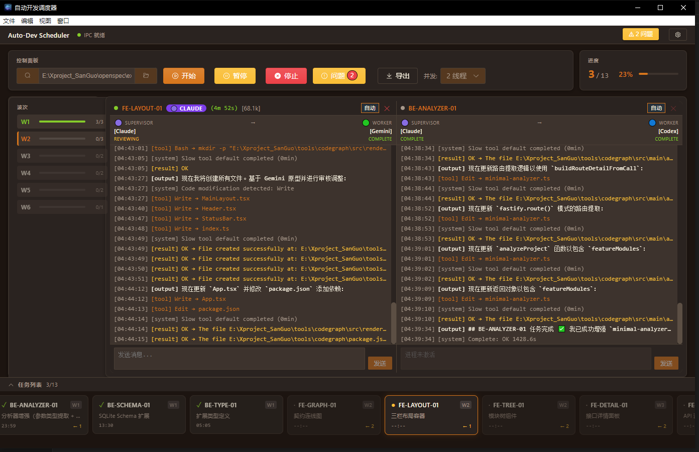

# Auto-Dev Scheduler (ADS)

> **Multi-Claude Parallel Development Orchestrator** 🚀
>
> 基于 OpenSpec 规范的智能并发开发调度系统，让多个 Claude 实例协同工作，加速开发流程。
>
> **版本**: v2.0 | **License**: MIT | **支持**: Windows / macOS / Linux

> ⚠️ **Token 成本提醒**
>
> 每个 Worker 是独立的 Claude 进程，上下文无法共享：
> - 每个任务启动时都要重新读取项目配置（CLAUDE.md、openspec/）
> - 每个 Worker 需要独立理解代码库结构
> - **10 个任务 = 10 次项目理解开销**（与并发数无关）
>
> 权衡：用更多 Token 换取更快的开发速度。建议合理控制任务粒度，避免拆分过细。

## ✨ 核心功能

### Phase 4 Claude-First Architecture

- **🔀 Claude-First 路由**: 所有任务统一由 Claude 执行，通过 MCP 工具智能委派给 Codex/Gemini
- **🎯 智能委派**: Claude 根据任务特征自动决定是否调用：
  - `mcp__codex__codex`: 后端逻辑、算法、Bug 修复
  - `mcp__gemini__gemini`: 前端 UI、样式、交互设计
- **📊 ECharts 可视化**: 实时模型分布图、任务进度图表、委派链路追踪
- **⚡ 并发执行**: 1-4 个 Claude Worker 同时工作，支持 Wave 波次和依赖管理
- **👁️ 可视化监控**: 实时查看任务状态、Worker 日志、Token 消耗、模型分布
- **🏥 健康监控**: Watchdog 进程检测、活动超时检测、分层诊断（规则 + AI）
- **💾 状态持久化**:
  - 任务完成自动更新 AUTO-DEV.md checkbox
  - Issue 追踪跨会话保存
  - Worker 委派历史记录
- **🛡️ 错误恢复**: API 速率限制处理、指数退避重试、自动恢复机制
- **🔧 OpenSpec 集成**: 完整支持 proposal → apply → archive 工作流

## 📸 项目效果图

### 主调度界面



**界面特性**：
- **左侧波次管理**: 可视化展示 Wave 1-6 的任务分组和执行进度
- **中央日志面板**: 实时显示 Claude 任务执行日志（含时间戳、工具调用、代码修改）
- **右侧进度追踪**: 显示当前执行进度（3/13 = 23%）、模型分布、Worker 状态
- **任务卡片**: 底部可拖拽的任务卡片，支持一键查看任务详情和日志

**关键指标**：
- 🟢 Claude 任务正在执行（4m 52s 已耗时）
- 🟣 Supervisor 辅助模式监控任务健康
- 📊 ECharts 实时绘制模型使用分布

### Blocker 自动暂停


**自动暂停机制**：
- 调度器检测到编译错误或依赖冲突时自动暂停执行
- 弹窗显示具体问题：`TASK-0.2 缺少功能未实现，阻塞 TASK-0.3`
- 提示用户修复后可点击"继续并忽略阻塞"继续执行
- 完整记录问题原文件和代码位置，支持快速定位

**Blocker 类型**：
- 🔴 编译错误（TypeScript/Babel）
- 🔴 运行时错误（ReferenceError、TypeError）
- 🔴 依赖缺失（npm 包、文件导入）
- 🔴 功能不完整（标记为 BLOCKER 的任务）

## 🎯 工作流程

```
┌─────────────┐     ┌──────────────┐     ┌──────────────┐     ┌──────────────┐
│  需求分析   │ → │  OpenSpec    │ → │  AUTO-DEV    │ → │  并发执行    │
│ (User)      │     │  规范化      │     │  生成        │     │  (Scheduler) │
└─────────────┘     └──────────────┘     └──────────────┘     └──────────────┘
                           ↓
                    /openspec:proposal
                           ↓
            proposal.md + tasks.md + design.md
                           ↓
                      ┌─────────────────┐
                      │   审核批准      │
                      │  (Peer Review)  │
                      └─────────────────┘
                           ↓
                   手动转换为 AUTO-DEV.md
                           ↓
                    /openspec:apply
                           ↓
                  Electron 调度器启动
                           ↓
              多 Claude Worker 并发执行
                           ↓
                      验收测试 (QA)
                           ↓
                    /openspec:archive
                           ↓
                    功能归档完成
```

### 关键步骤说明

| 步骤 | 命令 | 工件 | 说明 |
|------|------|------|------|
| **规范化** | `/openspec:proposal` | proposal.md, tasks.md, design.md | 使用 OpenSpec 规范创建变更提案 |
| **转换** | 手动/模板 | AUTO-DEV.md | 将细粒度 tasks 转为粗粒度并发任务 |
| **执行** | `/openspec:apply` | Electron GUI | 启动调度器并发执行 |
| **归档** | `/openspec:archive` | archive/ | 归档完成的变更到规范库 |

### 1. 创建提案

```bash
/openspec:proposal my-feature
```

与 Claude 讨论需求，生成方案文档：
- `openspec/changes/my-feature/proposal.md` - 需求和目标
- `openspec/changes/my-feature/tasks.md` - 细粒度任务清单（单人用）
- `openspec/changes/my-feature/design.md` - 技术决策（可选）

### 1.5. 转换为并发任务（重要步骤）

**方式 A: 手动创建**（推荐）

根据 `tasks.md` 创建 `openspec/execution/my-feature/AUTO-DEV.md`：

1. 按可并行维度（前端/后端/模块）将任务分组到 Wave
2. 每个 Wave 内的任务可并发执行
3. 设置任务间的依赖关系

**格式要求**：
```markdown
## 并行波次图

Wave 1: TASK-01, TASK-02, TASK-03
Wave 2: TASK-04, TASK-05
Wave 3: TASK-06

---

## Wave 1: 描述

### TASK-01: 任务标题

- [ ] 任务描述

**依赖**: 无
**Persona**: codex/backend （可选，指定使用的模型）

**执行步骤**:
1. 步骤 1
2. 步骤 2

**验收标准**:
- 标准 1
- 标准 2
```

**方式 B: 使用模板**

复制 `openspec/execution/README.md` 中的模板并填充内容。

**关键区别**：
- `tasks.md` = 细粒度串行任务（适合单人执行）
- `AUTO-DEV.md` = 粗粒度并发任务（适合多 Claude 并发）

### 2. 启动调度

```bash
/openspec:apply my-feature
```

调度器 GUI 启动后：
1. 选择并发数（1-4）
2. 点击 **Start** 开始执行
3. 实时监控各 Worker 进度

### 3. 验收归档

所有任务完成后测试功能，确认无误后归档：

```bash
/openspec:archive my-feature
```

## 安装

### 方式一：在线安装（推荐）

**Windows (PowerShell)**：
```powershell
irm https://raw.githubusercontent.com/zengruifeng56-del/auto-dev-scheduler/master/install.ps1 | iex
```

**macOS/Linux (Bash)**：
```bash
curl -fsSL https://raw.githubusercontent.com/zengruifeng56-del/auto-dev-scheduler/master/install.sh | bash
```

### 方式二：源码运行

```bash
cd tools/auto-dev-scheduler-web
npm install
npm run dev
```

### 方式三：打包安装程序

```bash
cd tools/auto-dev-scheduler-web
npm install
npm run build:win
# 生成 release/Auto-Dev-Scheduler-Setup-1.0.0.exe
```

## 更新

已安装旧版本的用户，重新运行安装命令即可更新：

```powershell
irm https://raw.githubusercontent.com/zengruifeng56-del/auto-dev-scheduler/master/install.ps1 | iex
```

安装脚本会自动覆盖更新以下文件：
- `.claude/commands/` - OpenSpec 命令
- `openspec/AGENTS.md` - 代理指南
- `tools/auto-dev-scheduler-web/` - 调度器应用

> 不会覆盖：`openspec/project.md`（项目配置）、`openspec/changes/`（变更提案）、`openspec/execution/`（执行文件）

## AUTO-DEV.md 格式

```markdown
## 并行波次图

Wave 1: BE-01, BE-02
Wave 2: FE-01, FE-02
Wave 3: REVIEW-SYNC

---

## Wave 1: 后端基础

### BE-01: 数据库设计

- [ ] 创建数据表

**依赖**: 无

### BE-02: API 接口

- [ ] 实现 CRUD 接口

**依赖**: BE-01
```

**格式要求**：
- 并行波次图必须在文件顶部，格式 `Wave N: ID1, ID2, ...`
- 任务标题：`### {ID}: {标题}`
- 必须包含 `- [ ]` checkbox 或 `**依赖**` 字段
- 依赖声明：`**依赖**: ID1, ID2` 或 `**依赖**: 无`

## 任务 ID 格式

支持 `XX-YY` 或 `XX.YY` 格式：

| 前缀 | 用途 | 示例 |
|------|------|------|
| `BE-` | 后端任务 | BE-01, BE-API-01 |
| `FE-` | 前端任务 | FE-01, FE-AUTH-01 |
| `TASK-` | 通用任务 | TASK-001 |
| `TEST-` | 测试任务 | TEST-UNIT-01 |

## 技术栈

- **Electron 28** + **Vue 3.4** + **TypeScript**
- **Element Plus** UI 组件库
- **Pinia** 状态管理

## 🔧 系统配置

### 配置文件位置

调度器的行为通过以下文件配置：

| 文件 | 位置 | 用途 |
|------|------|------|
| **路由规则** | `.claude/commands/auto-dev.md` | 定义任务分配规则（哪些任务用 Claude/Codex/Gemini） |
| **Persona 提示词** | `.claude/prompts/personas/{model}/{domain}.md` | 模型角色定义和工作风格 |
| **执行任务** | `openspec/execution/{project}/AUTO-DEV.md` | 并发任务清单（波次和依赖） |

### 根据现有工作流配置调度器

**场景 1：我已经有现成的 Codex 和 Gemini MCP**

无需配置，调度器会自动检测并使用。启动即可：
```bash
npm run dev
```

**场景 2：我只想用 Claude 执行，不用 MCP 工具**

调度器会自动降级到纯 Claude 模式，所有任务都由 Claude 处理：
```bash
npm run dev
# 调度器会自动识别 MCP 不可用，转为 Claude-only 模式
```

**场景 3：我有自定义的模型集成（例如：我用了其他 LLM API）**

需要修改路由规则和 Persona 文件：

1. **编辑 `.claude/commands/auto-dev.md`** — 找到路由表（~line 460）：
   ```markdown
   ### 任务路由规则

   | 任务模式 | 分配给 | Persona 文件 | 说明 |
   |--------|--------|-----------|------|
   | FE-* | MyCustomModel | .claude/prompts/personas/custom/frontend-expert.md | 前端任务 |
   | BE-* | MyCustomModel | .claude/prompts/personas/custom/backend-expert.md | 后端任务 |
   | 其他 | Claude | 直接执行 | 默认行为 |
   ```

2. **创建 Persona 文件** — `.claude/prompts/personas/custom/frontend-expert.md`：
   ```markdown
   # 前端开发专家

   你是一个资深前端工程师，专注于 React/Vue 开发。

   ## 工作要求
   - 输出格式：Unified Diff Patch ONLY
   - 不进行实际文件修改
   - 遵循项目规范和代码风格
   ```

3. **配置模型委派** — 修改 `tools/auto-dev-scheduler-web/src/worker-factory.ts`：
   ```typescript
   // 在 createWorker 函数中添加自定义模型检测
   if (persona.includes('custom')) {
     return new MyCustomWorker(taskId, persona, context);
   }
   ```

**场景 4：我想使用混合策略（部分任务用 MCP，部分用 Claude）**

灵活配置路由表即可：
```markdown
| 任务模式 | 分配给 | 说明 |
|--------|--------|------|
| FE-REACT-* | Gemini | React 组件用 Gemini（UI 强） |
| FE-OTHER-* | Claude | 其他前端任务用 Claude |
| BE-* | Codex | 后端用 Codex（逻辑强） |
| TEST-* | Claude | 测试任务用 Claude |
```

### 验证配置

启动调度器后，在 UI 中观察：

1. **任务执行日志** — 查看是否出现委派调用（如 `Delegating to Codex` / `Delegating to Gemini`）
2. **模型分布图** — 右上角 ECharts 图表显示各模型使用比例
3. **委派追踪** — `DelegationTrace` 面板显示完整的委派链路

如果 MCP 工具不可用但任务仍能执行，说明已自动降级到 Claude-only 模式（正常）。

## 📋 系统要求

### 硬件要求

| 配置 | 最低 | 推荐 |
|------|------|------|
| CPU | 2 核 | 4 核+ |
| RAM | 4 GB | 8 GB+ |
| 磁盘 | 500 MB | 2 GB+ |
| 网络 | 稳定连接 | 高速网络 |

### 软件要求

- **操作系统**: Windows 10+ / macOS 12.0+ / Ubuntu 20.04+
- **Node.js**: >= 20 (推荐 20.10+)
- **npm**: >= 10.0
- **Git**: >= 2.30
- **Claude CLI**: 必需 (最新版本)
- **OpenSpec CLI**: 必需 (用于 proposal/archive 命令)

### 平台特定说明

#### Windows
- ✅ 完整支持，Electron 应用 + NSIS 安装程序
- 推荐使用 PowerShell 运行安装脚本

#### macOS (New in v2.0)
- ✅ 完整支持，包括 M1/M2 ARM64 芯片
- 需要 Command Line Tools: `xcode-select --install`
- 推荐使用 Homebrew: `brew install node openspec`
- 详见 **MAC_GUIDE.md**

#### Linux (New in v2.0)
- ✅ 完整支持，多发行版覆盖 (Ubuntu/Debian/Fedora/CentOS/Arch)
- 支持开发模式和 Docker 容器化部署
- 支持 Systemd 服务集成（生产环境）
- 详见 **LINUX_GUIDE.md**

## ❓ 常见问题

### Q1: 调度器无法启动 Claude？

**解决**:
```bash
# 检查 Claude CLI 是否安装
claude --version

# 检查 API Key 配置
echo $ANTHROPIC_API_KEY

# 如果都没问题，在调度器设置中重新配置
# Settings → 输入正确的 claude 命令路径
```

### Q2: Worker 卡住或无响应？

**解决**:
1. 点击 Worker 日志面板右上角的 **✕** 按钮终止进程
2. 任务会自动重置为待执行状态
3. 点击 **重试** 按钮重新执行
4. 如果频繁卡住，调整超时配置

### Q3: 如何调整超时时间？

**操作步骤**:
1. 点击调度器界面的 **⚙️ Settings** 按钮
2. 可配置以下项：
   - **普通操作超时**: 默认 10 分钟
   - **慢工具超时** (Codex/Gemini): 默认 60 分钟
   - **npm install 超时**: 默认 15 分钟
   - **Blocker 自动暂停**: 启用自动暂停
   - **自动重试**: 启用自动重试（最多 2 次）

### Q4: 失败任务如何重试？

**自动重试**:
- 启用 Settings 中的"自动重试"
- 失败任务会自动重试（指数退避）
- 显示实时倒计时

**手动重试**:
- 点击失败任务行的 **↻** 按钮
- 会级联重置依赖该任务的后续任务

### Q5: 调度器占用太多内存？

**优化**:
```bash
# 增加 Node.js 内存限制
export NODE_OPTIONS="--max-old-space-size=4096"
npm run dev

# 或减少并发 Worker 数量
# Settings → 设置为 1-2 个 Worker
```

### Q6: Windows/Mac/Linux 上安装失败？

**解决**:
- Windows: 查看 README 的 Windows 安装部分
- macOS: 查看 **MAC_GUIDE.md**
- Linux: 查看 **LINUX_GUIDE.md**

这三份文档包含各平台的完整故障排查步骤。

### Q7: 如何使用 Docker 运行？

**仅限 Linux 用户**：

```bash
# 使用 docker-compose
docker-compose up

# 访问 http://localhost:5174
```

详见 **LINUX_GUIDE.md** 的 Docker 部分。

## ⚠️ 注意事项

### 安全性
- 调度器使用 `--dangerously-skip-permissions` 启动 Claude，**仅在可信项目中使用**
- 不要在生产环境直接运行调度器，使用受控的 Docker 容器

### 性能和成本
- 每个 Worker 是独立的 Claude 进程，上下文**无法共享**
- 10 个任务 = 10 次完整的项目理解开销（与并发数无关）
- **建议**: 合理控制任务粒度，避免拆分过细（每个任务 > 2 小时工作量）

### 并发控制
- 任务依赖设计合理可避免代码冲突，**调度器不检测文件级冲突**
- Wave 序列严格按顺序执行，同 Wave 内的任务并发执行
- 避免在 Wave 间设置过多依赖关系

### 状态管理
- 失败状态仅保存在**内存**中，调度器重启后丢失
- 只有 **成功状态** 会写入 AUTO-DEV.md（持久化）
- Issue 追踪状态会跨会话持久化（存储到 userData）

### 网络和超时
- Claude CLI 调用需要**稳定网络**
- 慢速网络环境建议增加超时时间
- 某些工具调用（codex/gemini）可能耗时较长，默认 60 分钟超时

## 相关链接

- [OpenSpec GitHub](https://github.com/Fission-AI/OpenSpec)
- [Claude Code 官方文档](https://docs.anthropic.com/claude-code)

## 架构演进

### Phase 4: Claude-First Architecture (2026-01)

**核心变更**：所有任务统一由 Claude 执行，通过 MCP 工具智能委派

- **统一入口**：所有任务类型（前端/后端/测试）都由 Claude Worker 处理
- **智能委派**：Claude 根据任务特征决定是否调用专家模型（可选）：
  - `mcp__codex__codex`: 后端逻辑、算法、Debug 任务 — [安装指南](https://linux.do/t/topic/1147571)
  - `mcp__gemini__gemini`: 前端 UI、样式、组件任务 — [安装指南](https://linux.do/t/topic/1211767)
- **路由规则**：`.claude/commands/auto-dev.md` 中的路由表提供委派提示，但最终决策权在 Claude
- **废弃特性**：直接实例化 Codex/Gemini Worker 的方式已移除

#### MCP 工具配置

**第一步：检查 MCP 可用性**

```bash
# 检查是否已安装 Codex MCP
claude list-mcp | grep codex

# 检查是否已安装 Gemini MCP
claude list-mcp | grep gemini
```

**第二步：安装 MCP 工具（可选）**

如果上述命令未找到对应工具，可按照以下指南安装：
- **Codex MCP**: https://linux.do/t/topic/1147571（用于后端/算法任务）
- **Gemini MCP**: https://linux.do/t/topic/1211767（用于前端/UI 任务）

**第三步：自定义适配本地工作流**

如果你有现有的 Claude CLI 工作流或其他模型集成，需要修改调度器配置以适配：

1. **编辑路由规则** — `.claude/commands/auto-dev.md`（~line 460）：
   ```markdown
   | 任务模式 | 分配给 | Persona 文件 | 说明 |
   |--------|--------|-----------|------|
   | FE-REACT-* | 你的模型 | .claude/prompts/personas/{你的模型}/react-expert.md | React 组件开发 |
   | BE-API-* | 你的模型 | .claude/prompts/personas/{你的模型}/backend-expert.md | 后端 API |
   ```

2. **创建 Persona 文件** — `.claude/prompts/personas/{你的模型}/{领域}.md`：
   ```markdown
   # {领域} 专家角色定义

   你是一个 {领域} 开发专家，具有深厚的技术背景。

   ## 擅长领域
   - ...

   ## 工作风格
   - 输出 Unified Diff Patch 格式
   - 不进行实际文件修改
   ```

3. **验证配置** — 启动调度器后，观察日志中是否出现委派调用。如果 MCP 不可用，Claude 会自动使用纯 Claude 执行（功能完整但可能耗时更长）。

#### 可选配置建议

**推荐配置**（开箱即用，需安装对应 MCP）：
```bash
# 如果完整安装了 Codex + Gemini MCP
# 调度器会自动利用：
# - Codex 处理后端逻辑、代码 Debug
# - Gemini 处理前端 UI、样式、交互

# 启动调度器
npm run dev
```

**最小化配置**（无需额外安装）：
```bash
# 如果未安装 MCP 工具
# Claude 会直接处理所有任务，功能不受影响
# 只是某些任务可能需要更多时间

# 启动调度器
npm run dev
```

**混合配置**（只用部分 MCP）：
```bash
# 编辑 .claude/commands/auto-dev.md
# 将某些任务模式分配给 Claude，某些分配给 MCP
# 例如：前端用 Gemini，后端用 Claude 直接处理
```

**新增模块**：

**核心委派层**:
- `worker-factory.ts`: Worker 创建工厂，支持 Claude / Codex / Gemini 自动选择
- `routing-registry.ts`: 任务路由规则库（定义哪些任务类型分配给哪个模型）

**调度器子系统** (`scheduler/`):
- `compile-checker.ts`: TypeScript 编译检查，自动修复编译错误
- `issue-tracker.ts`: 跨任务问题追踪，自动识别 blocker 级别问题
- `resilience-manager.ts`: API 错误恢复（速率限制、指数退避重试）
- `session-persistence.ts`: 会话暂停/恢复，支持长时间运行任务恢复
- `task-manager.ts`: 任务生命周期管理（待执行/执行中/完成/失败）
- `worker-pool.ts`: Worker 实例池，管理并发 Worker 的创建与回收

**验证与存储**:
- `metadata-validator.ts`: AUTO-DEV.md 格式校验，确保文件符合调度器要求
- `artifact-store.ts`: 任务输出物管理（代码、日志、报告）

**UI 增强**：
- `ModelDistributionChart.vue`: 实时模型使用分布图（ECharts 可视化）
- `DelegationTrace.vue`: 可视化委派链路（任务 → Claude → Codex/Gemini）
- `TaskCards.vue`/`WavesCard.vue`: 卡片式任务视图，支持拖拽和状态更新
- `ProgressCard.vue`/`ControlCard.vue`: 增强的进度和控制面板（开始/暂停/恢复）
- `ApiErrorOverlay.vue`: API 错误提示层（速率限制、超时告警）

## 📚 文档导航

| 用户类型 | 首先阅读 | 然后阅读 |
|---------|---------|---------|
| **新用户** | README.md | 平台特定指南 (MAC_GUIDE.md / LINUX_GUIDE.md) |
| **Windows 用户** | 本文档 | install.ps1 + TROUBLESHOOTING.md |
| **Mac 用户** | MAC_GUIDE.md | README.md |
| **Linux 用户** | LINUX_GUIDE.md | README.md, Docker 部分 |
| **升级用户** | MIGRATION.md | UPDATE-SUMMARY.md |
| **开发者** | BRAINSTORM-ANALYSIS.md | SYNC-ANALYSIS.md, 源代码 |

## 📊 更新日志

### v2.0 (2026-01-23) - Major Release with Cross-Platform Support

**🎉 重大更新**
- ✅ 品牌统一: SanGuo Tools Team → Auto-Dev Scheduler Contributors
- ✅ 完整的跨平台支持: Windows / macOS / Linux
- ✅ 新增 Mac 用户完整指南 (MAC_GUIDE.md)
- ✅ 新增 Linux 用户完整指南 + Docker 支持 (LINUX_GUIDE.md)
- ✅ OpenSpec 命令同步: 最新的 auto-dev.md
- ✅ 安装脚本增强: 自动依赖检查 + npm 安装

**🔧 技术改进**
- 增强 install.ps1: Claude CLI 和 OpenSpec CLI 强制检查
- 创建 install.sh: 跨 Unix 平台通用安装脚本
- 自动化 npm install: 减少新用户错误
- 完善 AUTO-DEV.md 生成流程文档

**📚 文档完善**
- 新增 8 个文档文件 (~60 KB)
- 补充 AUTO-DEV.md 生成指南
- 平台特定的故障排查文档
- 工作流程可视化

**支持范围**:
- Windows 10+: ✅ Electron + NSIS
- macOS 12.0+: ✅ 开发模式 + 详细指南
- Ubuntu 20.04+: ✅ 多发行版 + Docker + Systemd
- Node.js 20+: ✅ 完整支持

### v1.5.0 (2026-01) - Phase 4 Release

**重大架构变更**
- Claude-First 架构：统一通过 Claude 路由所有任务
- Worker Factory 模式：集中式 Worker 创建与路由
- Scheduler 子系统重构：模块化的调度器组件
- 智能委派系统：基于任务特征的自动模型选择

**新功能**
- ECharts 可视化：模型使用分布、任务进度图表
- 委派追踪：实时显示 Claude → Codex/Gemini 委派链路
- 元数据校验：AUTO-DEV.md 格式自动检查
- Artifact 管理：任务输出物集中存储
- 测试支持：集成 Vitest 测试框架

**依赖更新**
- 新增：`echarts` ^6.0.0
- 新增：`vue-echarts` ^8.0.1
- 新增：`vitest` ^2.1.0

### v1.4.0 (2024-12)

**新功能**
- 会话持久化：Issue、任务状态、暂停原因跨会话保存，重启后自动恢复
- 设置持久化：Watchdog、AutoRetry 配置跨项目保存到 userData
- Blocker 自动暂停：检测到 blocker 级别问题时自动暂停，显示模态弹窗提示
- 暂停原因追踪：区分用户手动暂停和 blocker 自动暂停

**Bug 修复**
- 修复 Windows GUI 模式下 EPIPE 崩溃：console.log 写入已关闭的 stdout 管道导致应用崩溃
- 添加全局 EPIPE 错误处理：防止 stdout/stderr 管道断开时崩溃

**改进**
- Settings 对话框新增 Blocker 自动暂停开关
- 状态栏显示暂停原因（用户/blocker）

### v1.3.0 (2024-12)

**新功能**
- Issue 收集面板：Worker 运行时自动收集问题报告，按严重级别分类（blocker/error/warning）
- Issue 去重合并：相同问题自动合并，记录出现次数
- Issue 注入集成任务：INT-*/INTEGRATION* 任务启动时自动注入待解决 Issue 列表
- Issue 报告协议：Worker 发现跨任务问题时输出 `AUTO_DEV_ISSUE: {...}` 格式报告
- 自动重试：任务失败后自动调度重试，可配置最大重试次数（默认 2 次）
- 指数退避：重试延迟采用指数退避 + 随机抖动，避免雷鸣群效应
- 重试倒计时：任务表格显示实时倒计时，提示距下次重试的时间
- 配置 UI：Settings 对话框新增自动重试配置项（启用/禁用、最大次数、基础延迟）

**改进**
- 重试耗尽前不级联失败：给瞬态错误（网络波动、资源竞争）自动恢复的机会
- 手动重试时重置自动重试状态：确保完整的重试配额
- 状态栏显示 Issue 计数和 blocker 数量
- auto-dev.md 新增强制问题报告协议（Mandatory Issue Reporting）

### v1.2.0 (2024-12)

**新功能**
- 任务状态持久化：启动时尊重文件中已完成的任务状态
- 自动更新 checkbox：任务成功后自动将 `[ ]` 改为 `[x]`
- DELIVERY 任务规范：新增交付文档生成任务

**Bug 修复**
- 修复 checkbox 解析：支持缩进列表、`+` 标记、大写 `[X]`
- 修复慢工具超时被覆盖问题

### v1.1.0 (2024-12)

**架构变更**
- 移除 Git 同步和分布式锁，改为内存状态管理
- 简化流程，任务完成后正常退出即可

**新功能**
- 任务重试：失败任务一键重试
- 慢工具超时：codex/gemini 60分钟，npm 15-20分钟

### v1.0.0 (2024-12)

- Electron + Vue 3 桌面应用
- Watchdog 健康监控
- 可视化任务管理

---

## 捐助

如果这个项目对你有帮助，欢迎请作者喝杯咖啡 ☕


*使用支付宝扫码捐助*

---

## 致谢

- [OpenSpec](https://github.com/Fission-AI/OpenSpec) - 规格驱动开发框架
